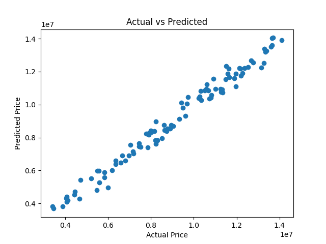
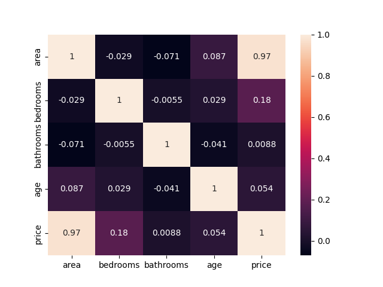
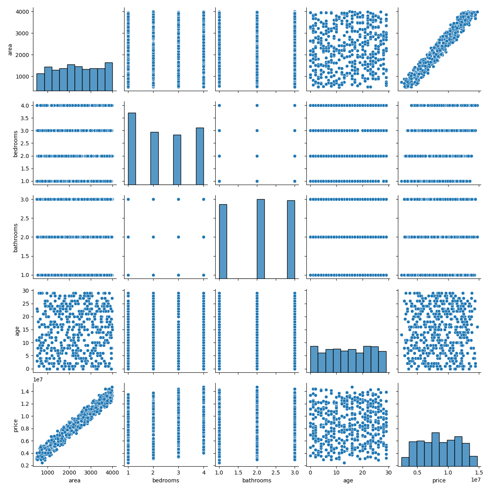
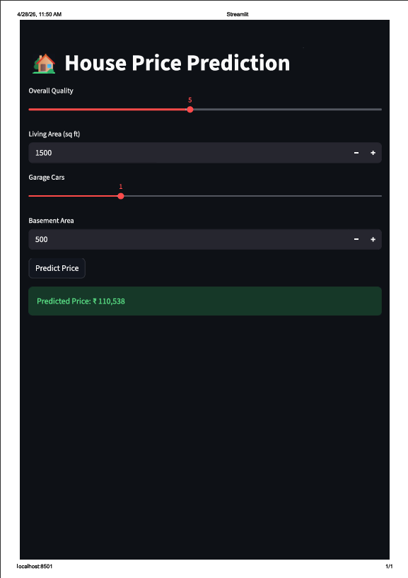
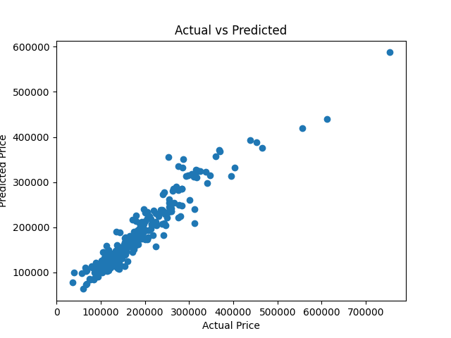

\# 🏡 House Price Prediction using Regression Models


\## 📌 Overview


This project predicts house prices based on property features such as area, quality, garage capacity, and basement size.

It demonstrates an \*\*end-to-end Machine Learning pipeline\*\* including data preprocessing, model training, evaluation, and deployment with a user interface.


\---


\## 🎯 Problem Statement


Estimating property prices manually is time-consuming and often inaccurate.

This project uses regression models to \*\*predict house prices automatically\*\*, helping buyers, sellers, and real estate platforms make better decisions.


\---


\## 🏭 Industry Relevance


\* Real estate platforms (price estimation)

\* Banks (loan collateral valuation)

\* Property investors (ROI analysis)

\* Brokers (pricing strategy)


\---


\## 🧰 Tech Stack


\* Python

\* Pandas, NumPy

\* Scikit-learn

\* Matplotlib, Seaborn

\* Streamlit (UI)

\* FastAPI (optional API)


\---


\## 📊 Dataset


\* Based on housing dataset (Ames Housing dataset style)

\* Includes 80+ features like:


&#x20; \* Area (GrLivArea)

&#x20; \* Overall Quality

&#x20; \* Garage capacity

&#x20; \* Basement area

&#x20; \* Location \& structural features


\---


\## ⚙️ ML Models Used


\* Linear Regression

\* Random Forest Regressor


\---


\## 📈 Evaluation Metrics


\* MAE (Mean Absolute Error)

\* RMSE (Root Mean Squared Error)

\* R² Score


\---


\## 🚀 Results


| Model             | MAE     | RMSE    | R²    |

| ----------------- | ------- | ------- | ----- |

| Linear Regression | \~20,000 | \~52,000 | \~0.64 |

| Random Forest     | \~17,000 | \~28,000 | \~0.89 |


👉 Random Forest performed better with higher accuracy.


\---


## 📸 Screenshots

### Actual vs Predicted


### Correlation Heatmap


### EDA Pairplot


### FastAPI Backend


### Prediction UI


### Sample Prediction



\## 🖥️ Project Structure


```

House-Price-Prediction/

│

├── data/

├── models/

├── api/

├── images/

├── app\_ui.py

├── main.py

├── requirements.txt

└── README.md

```


\---


\## ▶️ How to Run


\### 1. Clone repository


```

git clone https://github.com/your-username/house-price-prediction.git

cd house-price-prediction

```


\### 2. Install dependencies


```

pip install -r requirements.txt

```


\### 3. Run model training


```

python main.py

```


\### 4. Run Streamlit UI


```

streamlit run app\_ui.py

```


\---


\## 🌐 Output


\* User enters house details

\* Model predicts price instantly

\* Displayed in a clean UI


\---


\## 📸 Screenshots


Add images here:


\* Dataset preview

\* Model evaluation

\* Prediction graph

\* Streamlit UI


\---


\## 🧠 Learning Outcomes


\* Regression modeling

\* Feature engineering

\* Model evaluation \& comparison

\* ML deployment basics

\* Building UI with Streamlit


\---


\## 🔮 Future Improvements


\* Add location-based pricing

\* Use XGBoost / LightGBM

\* Deploy online (Streamlit Cloud / Render)

\* Add explainability (SHAP)


\---


\## 👩‍💻 Author


Fathima Luluh


\---


\## ⭐ If you like this project


Give it a ⭐ on GitHub!


